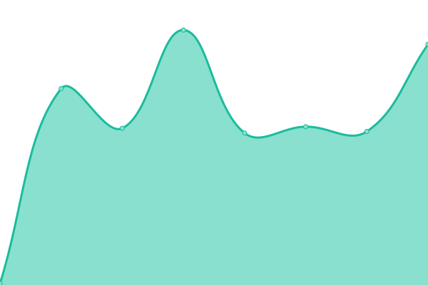

# [📈 Live Status](https://status.ambyrenodes.net): <!--live status--> **🟩 All systems operational**

This repository contains the open-source uptime monitor and status page for [AmbyreNodes](https://status.ambyrenodes.net), powered by [Upptime](https://github.com/upptime/upptime).

With [Upptime](https://upptime.js.org), you can get your own unlimited and free uptime monitor and status page, powered entirely by a GitHub repository. We use [Issues](https://github.com/AmbyreNodes/nodestatus/issues) as incident reports, [Actions](https://github.com/AmbyreNodes/nodestatus/actions) as uptime monitors, and [Pages](https://status.ambyrenodes.net) for the status page.

<!--start: status pages-->
<!-- This summary is generated by Upptime (https://github.com/upptime/upptime) -->
<!-- Do not edit this manually, your changes will be overwritten -->
<!-- prettier-ignore -->
| URL | Status | History | Response Time | Uptime |
| --- | ------ | ------- | ------------- | ------ |
|  [DE KVM Compute HV 1](ds-hv-kvmcompute-1.de-fsn.ambyrenodes.net) | 🟩 Up | [de-kvm-compute-hv-1.yml](https://github.com/AmbyreNodes/nodestatus/commits/HEAD/history/de-kvm-compute-hv-1.yml) | 

 122ms
     
 | 

<a href="https://status.ambyrenodes.net/history/de-kvm-compute-hv-1">100.00%</a>
    

|  [DE KVM Compute HV 2](ds-hv-kvmcompute-2.de-fsn.ambyrenodes.net) | 🟩 Up | [de-kvm-compute-hv-2.yml](https://github.com/AmbyreNodes/nodestatus/commits/HEAD/history/de-kvm-compute-hv-2.yml) | 

 121ms
     
 | 

<a href="https://status.ambyrenodes.net/history/de-kvm-compute-hv-2">100.00%</a>
    

|  [DE KVM Compute HV 3](ds-hv-kvmcompute-3.de-fsn.ambyrenodes.net) | 🟩 Up | [de-kvm-compute-hv-3.yml](https://github.com/AmbyreNodes/nodestatus/commits/HEAD/history/de-kvm-compute-hv-3.yml) | 

 122ms
     
 | 

<a href="https://status.ambyrenodes.net/history/de-kvm-compute-hv-3">100.00%</a>
    

|  [DE KVM Compute HV 4](ds-hv-kvmcompute-4.de-fsn.ambyrenodes.net) | 🟩 Up | [de-kvm-compute-hv-4.yml](https://github.com/AmbyreNodes/nodestatus/commits/HEAD/history/de-kvm-compute-hv-4.yml) | 

 120ms
     
 | 

<a href="https://status.ambyrenodes.net/history/de-kvm-compute-hv-4">100.00%</a>
    

|  [DE KVM Compute HV 5](ds-hv-kvmcompute-5.de-fsn.ambyrenodes.net) | 🟩 Up | [de-kvm-compute-hv-5.yml](https://github.com/AmbyreNodes/nodestatus/commits/HEAD/history/de-kvm-compute-hv-5.yml) | 

 118ms
     
 | 

<a href="https://status.ambyrenodes.net/history/de-kvm-compute-hv-5">100.00%</a>
    

|  [DE KVM Compute HV 6](ds-hv-kvmcompute-6.de-fsn.ambyrenodes.net) | 🟩 Up | [de-kvm-compute-hv-6.yml](https://github.com/AmbyreNodes/nodestatus/commits/HEAD/history/de-kvm-compute-hv-6.yml) | 

 118ms
     
 | 

<a href="https://status.ambyrenodes.net/history/de-kvm-compute-hv-6">100.00%</a>
    

|  [DE KVM Compute HV 7](ds-hv-kvmcompute-7.de-fsn.ambyrenodes.net) | 🟩 Up | [de-kvm-compute-hv-7.yml](https://github.com/AmbyreNodes/nodestatus/commits/HEAD/history/de-kvm-compute-hv-7.yml) | 

 118ms
     
 | 

<a href="https://status.ambyrenodes.net/history/de-kvm-compute-hv-7">100.00%</a>
    

|  [DE KVM Compute HV 8](ds-hv-kvmcompute-8.de-fsn.ambyrenodes.net) | 🟩 Up | [de-kvm-compute-hv-8.yml](https://github.com/AmbyreNodes/nodestatus/commits/HEAD/history/de-kvm-compute-hv-8.yml) | 

 116ms
     
 | 

<a href="https://status.ambyrenodes.net/history/de-kvm-compute-hv-8">100.00%</a>
    

|  [DE KVM Compute HV 9](ds-hv-kvmcompute-9.de-fsn.ambyrenodes.net) | 🟩 Up | [de-kvm-compute-hv-9.yml](https://github.com/AmbyreNodes/nodestatus/commits/HEAD/history/de-kvm-compute-hv-9.yml) | 

 116ms
     
 | 

<a href="https://status.ambyrenodes.net/history/de-kvm-compute-hv-9">100.00%</a>
    

|  [DE KVM Compute HV 10](ds-hv-kvmcompute-10.de-fsn.ambyrenodes.net) | 🟩 Up | [de-kvm-compute-hv-10.yml](https://github.com/AmbyreNodes/nodestatus/commits/HEAD/history/de-kvm-compute-hv-10.yml) | 

 115ms
     
 | 

<a href="https://status.ambyrenodes.net/history/de-kvm-compute-hv-10">100.00%</a>
    

|  [DE KVM Compute HV 11](ds-hv-kvmcompute-11.de-fsn.ambyrenodes.net) | 🟩 Up | [de-kvm-compute-hv-11.yml](https://github.com/AmbyreNodes/nodestatus/commits/HEAD/history/de-kvm-compute-hv-11.yml) | 

 116ms
     
 | 

<a href="https://status.ambyrenodes.net/history/de-kvm-compute-hv-11">100.00%</a>
    

|  [DE KVM Compute HV 12](ds-hv-kvmcompute-12.de-fsn.ambyrenodes.net) | 🟩 Up | [de-kvm-compute-hv-12.yml](https://github.com/AmbyreNodes/nodestatus/commits/HEAD/history/de-kvm-compute-hv-12.yml) | 

 116ms
     
 | 

<a href="https://status.ambyrenodes.net/history/de-kvm-compute-hv-12">100.00%</a>
    

|  [DE KVM Compute HV 13](ds-hv-kvmcompute-13.de-fsn.ambyrenodes.net) | 🟩 Up | [de-kvm-compute-hv-13.yml](https://github.com/AmbyreNodes/nodestatus/commits/HEAD/history/de-kvm-compute-hv-13.yml) | 

 117ms
     
 | 

<a href="https://status.ambyrenodes.net/history/de-kvm-compute-hv-13">100.00%</a>
    

|  [DE KVM Compute HV 14](ds-hv-kvmcompute-14.de-fsn.ambyrenodes.net) | 🟩 Up | [de-kvm-compute-hv-14.yml](https://github.com/AmbyreNodes/nodestatus/commits/HEAD/history/de-kvm-compute-hv-14.yml) | 

 117ms
     
 | 

<a href="https://status.ambyrenodes.net/history/de-kvm-compute-hv-14">100.00%</a>
    

|  [DE KVM Compute HV 18](ds-hv-kvmcompute-18.de-fsn.ambyrenodes.net) | 🟩 Up | [de-kvm-compute-hv-18.yml](https://github.com/AmbyreNodes/nodestatus/commits/HEAD/history/de-kvm-compute-hv-18.yml) | 

 0ms
     
 | 

<a href="https://status.ambyrenodes.net/history/de-kvm-compute-hv-18">100.00%</a>
    

|  [DE KVM Compute HV 19](ds-hv-kvmcompute-19.de-fsn.ambyrenodes.net) | 🟩 Up | [de-kvm-compute-hv-19.yml](https://github.com/AmbyreNodes/nodestatus/commits/HEAD/history/de-kvm-compute-hv-19.yml) | 

 115ms
     
 | 

<a href="https://status.ambyrenodes.net/history/de-kvm-compute-hv-19">100.00%</a>
    

<!--end: status pages-->

[**Visit our status website →**](https://status.ambyrenodes.net)

## 📄 License

- Powered by: [Upptime](https://github.com/upptime/upptime)
- Code: [MIT](./LICENSE) © [AmbyreNodes](https://status.ambyrenodes.net)
- Data in the `./history` directory: [Open Database License](https://opendatacommons.org/licenses/odbl/1-0/)
